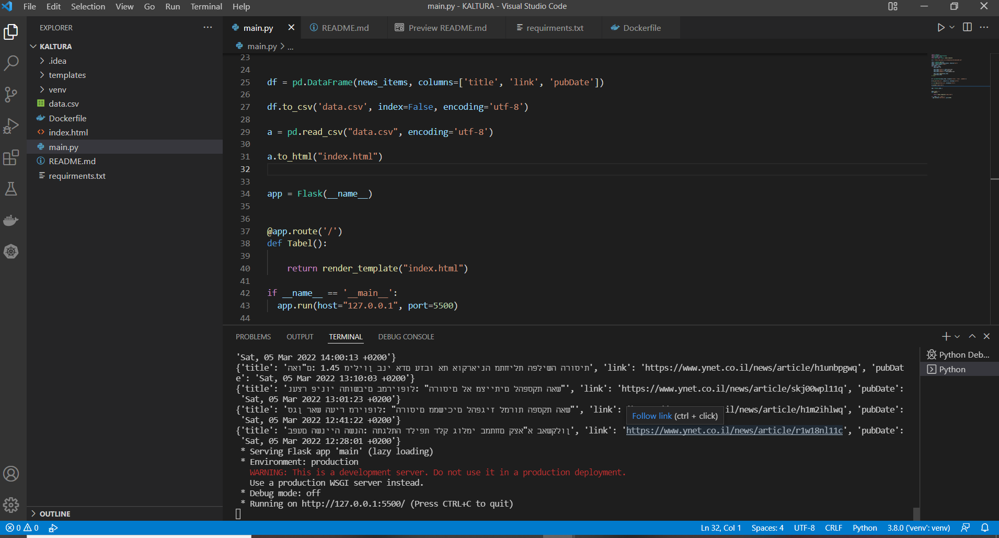
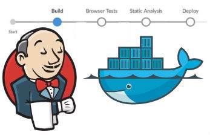
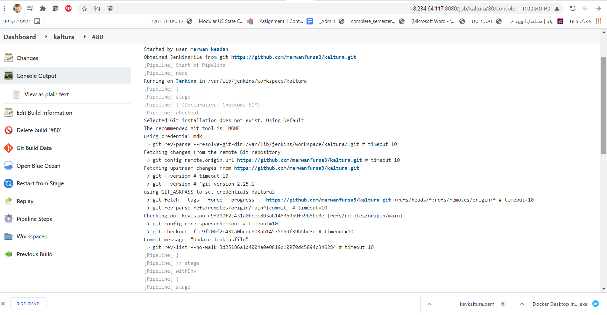
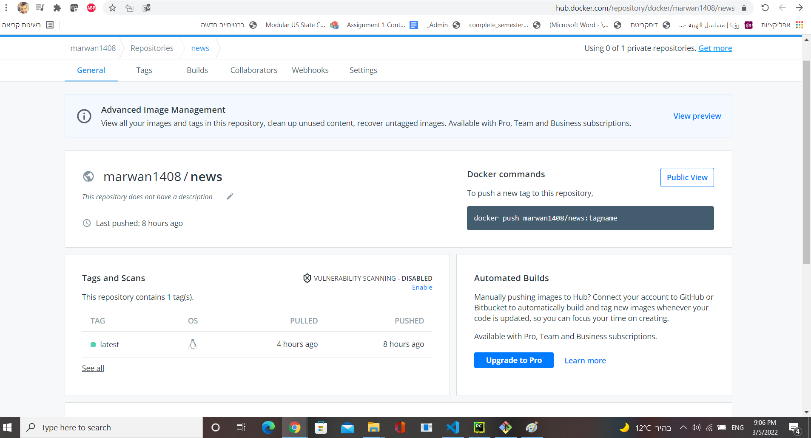
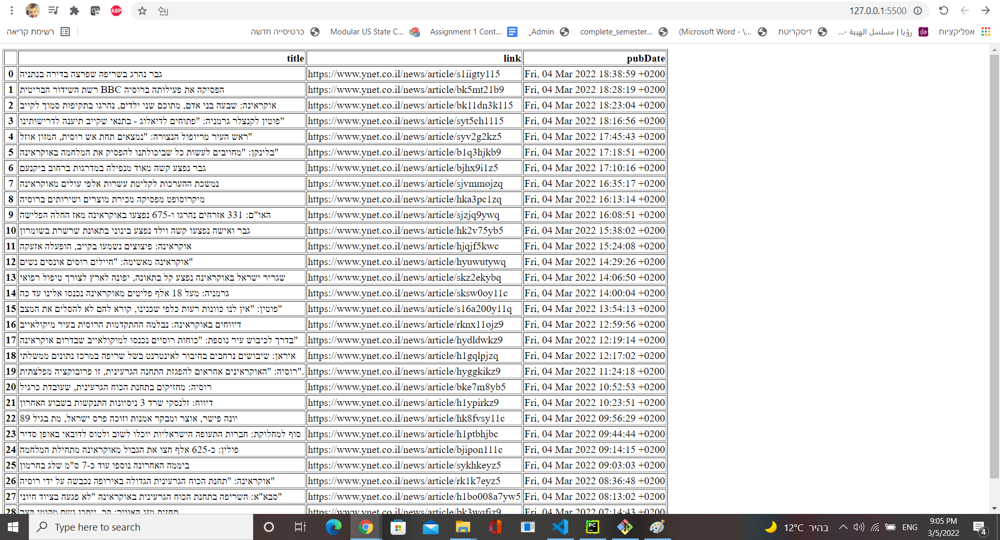
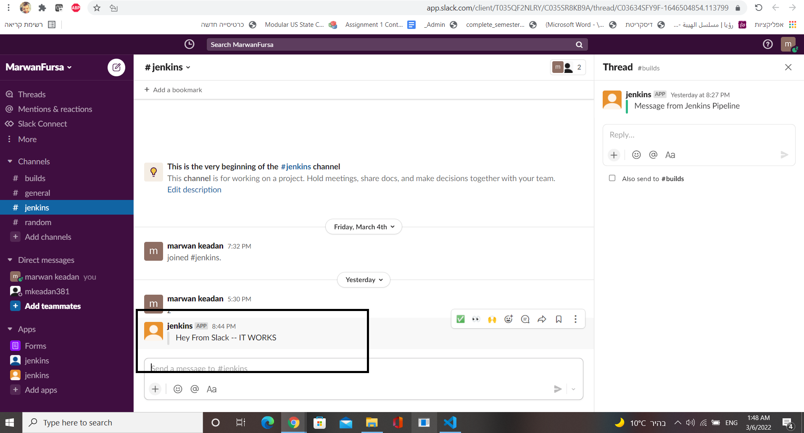

<h1 align="center">Kaltura Devops home assignment</h1>
<p align="center">
  
</p>

## Description
1. Receives port numbers (both http and https) as parameters.
2. Create a docker on your local pc which will:
a. Serve on above ports index.html
b. Contain latest notifications from https://www.ynet.co.il (doesn’t have to be
dynamically updated, but must be parsed).
3. Once done- send a status notification to a slack channel.

## Getting started

Clone the github repository
```
git clone https://https://github.com/marwanfursa3/kaltura
```
### Working in your IDE
#### Prerequisites
The following items should be installed and ready in your system:
* [docker](https://docs.docker.com/get-docker/)

* git command line tool , I prefer to work with git Bash. <a href="https://git-scm.com/downloads">download</a>.
* Your preferred IDE 
  
  * [Pycharm](https://www.jetbrains.com/pycharm/download/#section=windows)
  * [VS Code](https://code.visualstudio.com)


## Dockerfile
```buildoutcfg
FROM python

COPY requirments.txt .
RUN pip install -r requirments.txt


COPY . .

CMD ["python","main.py"]   
```
#### FROM:<br>
telling Docker what base image to use for the container, and implicitly selecting nginx.  <br><br>
#### COPY:<br>
The COPY instruction will copy new files from <src> and add them to the container's filesystem at path <dest><br><br>
#### CMD:<br>
The CMD command​ specifies the instruction that is to be executed when a Docker container starts

### How to use
1. Install Docker `sudo apt install docker.io -y`
2. build the image by running Docker build from a command line or terminal that is in the root directory of the application.
3. After it is built, you can run the image as a container.


    Commands:
    ```
    docker pull  marwan1408/news  
    docker run -it -d -p 5500:5500 marwan1408/news
    ```
	  


## Jenkins


1. Go to Jenkins homepage, click on “New Item”, select “Pipeline” and enter the job name as “kaltura”.
2. In "Pipeline SCM", add the github repository https://github.com/marwanfursa3/Kaltura.git 
3. Press on "Build Now" and go to "Console Output".
<br>
	  


## Run the app

#the image in dockerhub
<br>
	  


```
 Clone and run the app:

```sh
git clone https://https://github.com/marwanfursa3/kaltura
docker pull  marwan1408/news  
docker run -it -d -p 5500:5500 marwan1408/news
```

now you can access the app using : http://localhost:5500/  .
<br>
	  

## Jenkins CI/CD pipeline Job:
 This pipeline clones the project ,builds and runs it, and sends a slack notification.

Now simply connect the pipeline to the github repository and import the Jenkinsfile . 
you should see in the stage view that the pipeline passed the stages :


> This pipeline sends a slack notification,if you're intrested in sending one into your own slack channel, you have to setup the slack plugin pefore you run the jenkins file,
use this link for more detailes :https://kunzleigh.com/creating-a-slack-notifier-using-jenkins-pipeline/
	  
